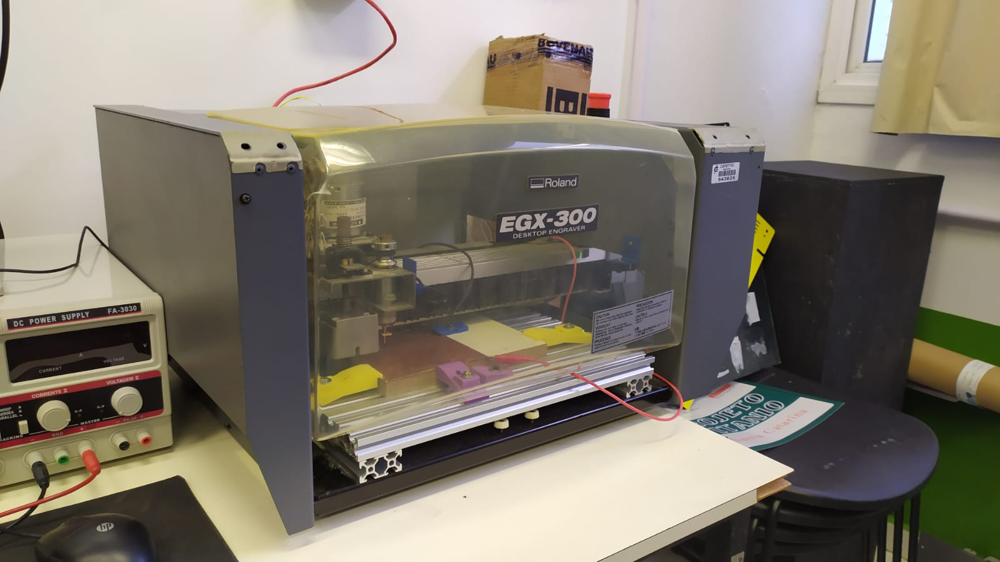
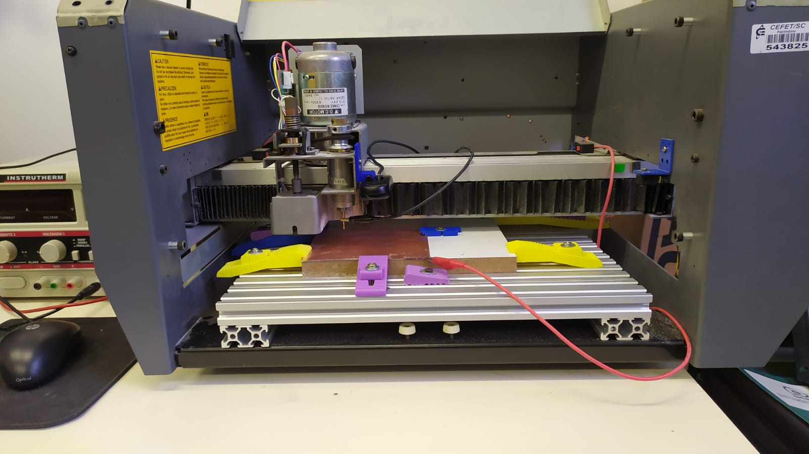
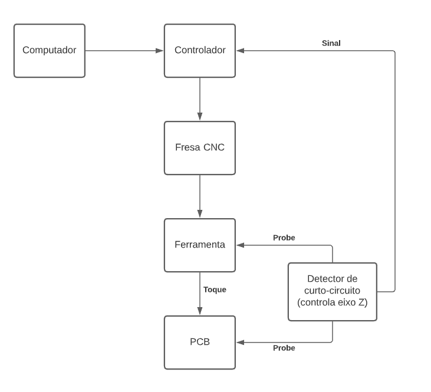

# Z-axis_controller
Este repositório servirá como documentação durante o desenvolvimento de um sistema detector de continuidade para o controle do eixo z de uma máquina CNC para prototipação de placas de circuito impresso (PCI) como parte da unidade curricular de Projeto Integrador III do IFSC campus Florianópolis.

## Estado atual

No estágio atual do estudo, o controle do eixo z da máquina é feito com a conexão de um cabo com o referencial da máquina na ferramenta utilizada pela fresa CNC, visto que não é possível conectar o VCC pelo fato de a carcaça do equipamento ser ligada ao referencial. Em seguida, é conectado um cabo à placa a ser confeccionada contendo o VCC. Neste cabo, é conectado à entrada do Arduino Uno, o qual é utilizado como controlador da máquina, e que está configurado como Pull Up. Quando a ferramenta toca na superfície da placa, um curto é fechado e a entrada do controlador vai para nível baixo, assim o sistema entende que houve o contato e envia o comando para que seja feita a medição no próximo ponto.

## Solução proposta

Para solucionar o problema dos cabos vindo da fonte externa, será feito um dispositivo que ficará fixado na própria máquina e que será alimentado pela própria fonte da mesma, tendo os níveis de tensão sendo regulados dentro do circuito. 

### Diagrama de blocos

## Referências

[1] Fuente, María J. de la. Fault detection and isolation: An Overview. Escuela de Ingenierías Industriales. Universidade de Valladolid

[2] Kim, Min-Sub et al. A novel fault detection circuit for short-circuit faults of IGBT

[3] Alvarez, Gustavo P.  Real-Time Fault Detection and Diagnosis Using Intelligent Monitoring and Supervision Systems. IntechOpen

[4] http://repository.psa.edu.my/bitstream/123456789/2128/1/MOBILE%20CONTINUITY%20TESTER.pdf

[5] https://www.nutsvolts.com/magazine/article/build-a-continuity-tester

[6] https://hackaday.com/2020/07/13/build-an-everlasting-continuity-tester/
